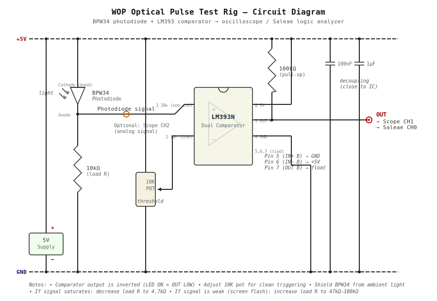

# Lab Test Rig: Optical Pulse Measurement

Measure and compare the optical pulses from the official manufacturer's app against ProjectL289Mobile to validate WOP protocol timing.

## Overview

The watch's photodetector sees light pulses at a 30ms bit period. We need to capture what the phone's LED flash (or screen) actually emits and compare it to known-good transmissions from the official app. A photodiode circuit converts light pulses into voltage transitions that an oscilloscope or Saleae logic analyzer can capture.

## Parts

### From Mouser order (invoice 89173259)

| Part | Mouser # | Purpose |
|------|----------|---------|
| BPW34 photodiode | 782-BPW34 | Light sensor — converts LED flash pulses to photocurrent. 430-1100nm range covers phone LED wavelengths. |
| LM393N/NOPB dual comparator | 926-LM393N/NOPB | Converts analog photodiode signal into clean digital edges for the logic analyzer. |
| 1µF MLCC capacitors (leaded) | 81-RCEC72A105K1M1H3A | Power supply decoupling. |
| 10K log potentiometer (15mm shaft) | 179-PTN091V10115K1A | Adjustable comparator threshold — tune for your specific phone's LED brightness. |

### From lab stock

| Part | Purpose |
|------|---------|
| 10kΩ resistor | Photodiode load resistor (sets sensitivity) |
| 100kΩ resistor | Pull-up for comparator open-collector output |
| 100nF ceramic capacitor | Additional decoupling |
| 5V bench supply or USB breakout | Power for comparator |
| Breadboard + jumper wires | Assembly |

## Circuit



### ASCII reference

```
                         +5V
                          │
                          ├──── 100nF ──── GND    (decoupling, close to LM393 pin 8)
                          │
                          ├──── 1µF ────── GND    (bulk decoupling)
                          │
                          │    LM393N (DIP-8)
                          │   ┌────────────┐
                          ├───┤ 8 (V+)     │
                          │   │            │
                     ┌────┼───┤ 3 (IN+)  1 ├───┬── OUT (to scope / Saleae CH0)
                     │    │   │    (non-inv)│   │
   BPW34             │    │   │            │   100kΩ  (pull-up, open-collector output)
  photodiode         │    │   │ 2 (IN-)    │   │
                     │    │   │  (inv)     │   │
  Cathode ─┤►├─ Anode┘    │   │   │        │   ├──── +5V
       (band)  │          │   │   │   4    │
               │          │   └───│───│────┘
             10kΩ         │       │   │
  (load R)   │          │       │  GND
               │          │       │
              GND         │      Wiper
                          │       │
                          │   ┌───┘
                          │   │
                          └───┤  10K pot
                              │  (threshold adjust)
                              │
                             GND
```

### Pin-by-pin wiring (LM393N DIP-8)

| Pin | Function | Connect to |
|-----|----------|------------|
| 1 | Output A | Scope/Saleae CH0, also pull up to +5V through 100kΩ |
| 2 | IN- (inverting) | Wiper of 10K potentiometer |
| 3 | IN+ (non-inverting) | Junction of BPW34 anode + 10kΩ load resistor |
| 4 | GND | Ground rail |
| 5 | IN+ B | Not used — tie to GND |
| 6 | IN- B | Not used — tie to +5V |
| 7 | Output B | Not used — leave floating |
| 8 | V+ | +5V rail |

### Photodiode wiring detail

The BPW34 runs in **photoconductive (reverse-biased)** mode for fast response:

```
+5V ──── Cathode ─┤►├─ Anode ──┬── to LM393 pin 3 (IN+)
         (marked          │
          band)         10kΩ
                          │
                         GND
```

- Light hits the BPW34 → photocurrent increases → voltage at anode rises
- No light → voltage drops toward 0V
- The 10kΩ load resistor converts photocurrent to voltage. If the LED is very bright and the signal saturates, increase to 4.7kΩ. If the signal is too weak (screen flash mode), increase to 47kΩ or 100kΩ.

### Threshold potentiometer

The 10K pot sets the comparator's switching threshold on pin 2 (IN-):

- **Start position:** Wiper at midpoint (~2.5V)
- **Tuning:** With the phone LED on steady, adjust until the comparator output just goes LOW (active). Then back off slightly so it triggers cleanly on pulses but ignores ambient light.
- The pot creates a simple voltage divider from +5V to GND.

### Why a comparator instead of just a resistor and scope?

You could connect the photodiode + load resistor directly to the scope and skip the comparator entirely. That works fine for the oscilloscope. But for the **Saleae logic analyzer**, you need clean digital edges — the comparator with adjustable threshold gives you:

1. Sharp 0V / 5V transitions regardless of ambient light level
2. A clean digital signal Saleae can decode without glitches
3. Adjustable sensitivity via the threshold pot

If you're only using the oscilloscope, you can skip the comparator and just probe the photodiode/resistor junction directly.

## How it works

1. **Phone emits light pulses.** The LED flash (torch mode) or screen (screen flash mode) turns on/off at 30ms intervals per the WOP bit encoding.

2. **Photodiode converts light to current.** The BPW34 generates photocurrent proportional to incident light intensity. In reverse-biased mode, response time is ~20ns — far faster than our 30ms bit period.

3. **Load resistor converts current to voltage.** The 10kΩ resistor creates a measurable voltage swing at the photodiode anode.

4. **Comparator digitizes the signal.** The LM393 compares the photodiode voltage (pin 3) against the pot threshold (pin 2). When light > threshold → output LOW (comparator sinks current). When light < threshold → output HIGH (pulled up by 100kΩ). Note: output polarity is inverted — LED ON = output LOW.

5. **Scope or logic analyzer captures the waveform.** You see the exact pulse timing the watch's photodetector would receive.

## Connecting the oscilloscope

### Equipment
- 100MHz oscilloscope (more than sufficient — our signal is ~33Hz fundamental)
- Standard 10x passive probe

### Setup
1. Connect scope probe to the **photodiode/resistor junction** (LM393 pin 3) for analog view, or to **comparator output** (LM393 pin 1) for digitized view.
2. Probe ground clip to circuit ground rail.
3. **Timebase:** 10ms/div gives you a good view of individual bits (3 divisions per bit period). For the full frame, use 100ms/div.
4. **Trigger:** Rising edge, single-shot mode. Set trigger level to ~50% of your signal amplitude.
5. **Vertical:** 1V/div for analog photodiode signal, 2V/div for comparator output.

### What to look for
- **Bit period:** Measure time between consecutive rising edges. Should be 30ms ±1ms.
- **Wake-up pulse:** 200ms solid ON followed by 50ms OFF gap.
- **Rise/fall time of LED:** Zoom in (1µs/div) on edges. This is the asymmetric offset the app compensates for. The official app's offset tells you how much the LED lags.
- **Header pattern:** After the wake-up gap, the first 8 bits should be `11101010` (0xEA) → 30ms ON, 30ms ON, 30ms ON, 30ms OFF, 30ms ON, 30ms OFF, 30ms ON, 30ms OFF.

## Connecting the Saleae logic analyzer

### Setup
1. Connect **CH0** to comparator output (LM393 pin 1).
2. Connect **GND** to circuit ground.
3. Optional: Connect **CH1** to photodiode/resistor junction for simultaneous analog view (Saleae Pro models).
4. **Sample rate:** 1 MHz is plenty (gives 30,000 samples per bit period). Even 100 kHz works.
5. **Trigger:** Rising edge on CH0.

### Capture settings in Logic 2
- Duration: 5 seconds (covers a full WOP frame transmission with margin)
- Voltage threshold: 3.3V (for the 0/5V comparator output)

## Validating and comparing: official app vs. ProjectL289Mobile

### Method 1: Oscilloscope overlay (quick visual check)

1. Capture the official app's transmission — use single-shot trigger, save screenshot or waveform to USB.
2. Capture ProjectL289Mobile's transmission with the same timezone/time settings.
3. Compare: bit periods, wake-up timing, header pattern, overall frame structure.
4. Key metric: **bit period jitter.** The official app presumably has tight timing. Measure stddev across 10+ consecutive bit periods for each app.

### Method 2: Saleae + Python analysis (recommended)

Export captures from Logic 2 and use [`analyze_captures.py`](analyze_captures.py) to decode and compare.

#### Export from Saleae Logic 2
1. After capture, go to **File → Export Raw Data**
2. Export CH0 as CSV with timestamps
3. Save as `official_capture.csv` and `project_capture.csv`

#### Run the analysis

```bash
# Single capture — timing stats + decoded bitstream
python docs/analyze_captures.py official_capture.csv

# Compare two captures — bit-by-bit diff + jitter comparison
python docs/analyze_captures.py official_capture.csv project_capture.csv
```

## Quick-start procedure

1. **Build the circuit** on a breadboard per the diagram above.
2. **Power it up** with 5V. Verify LM393 pin 8 = 5V, pin 4 = 0V.
3. **Position the BPW34** so it faces the phone's LED flash, ~1-2cm away. Use a small tube or shrink-wrap sleeve around the photodiode to block ambient light.
4. **Set the threshold pot** to midpoint. Turn on the phone flashlight steady. Adjust the pot until the comparator output just goes LOW. Back off slightly.
5. **Capture the official app:**
   - Set scope to single-shot trigger or start Saleae capture.
   - Run the official manufacturer's app and transmit.
   - Save the capture.
6. **Capture ProjectL289Mobile:**
   - Same physical setup — don't move the photodiode.
   - Same timezone and time settings.
   - Transmit and capture.
7. **Compare** using the oscilloscope overlay or the Python analysis script.

## Troubleshooting

| Problem | Likely cause | Fix |
|---------|-------------|-----|
| No signal at all | Photodiode backwards, or no power | Check BPW34 orientation (band = cathode toward +5V), verify 5V rail |
| Signal never goes LOW | Threshold too high | Turn pot to reduce threshold voltage |
| Signal stuck LOW | Threshold too low or saturated | Turn pot to increase threshold, or reduce load R to 4.7kΩ |
| Noisy edges / glitching | Ambient light, or missing decoupling | Shield the photodiode, add decoupling caps close to LM393 |
| Bit period reads ~16ms | Capturing screen refresh, not data | Make sure you're capturing torch mode, not screen flash mode (screen flash is unreliable) |
| Scope shows signal but Saleae doesn't trigger | Voltage below Saleae threshold | Verify comparator output swings to 5V (check pull-up resistor) |
